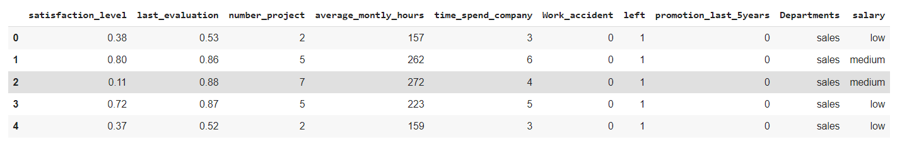
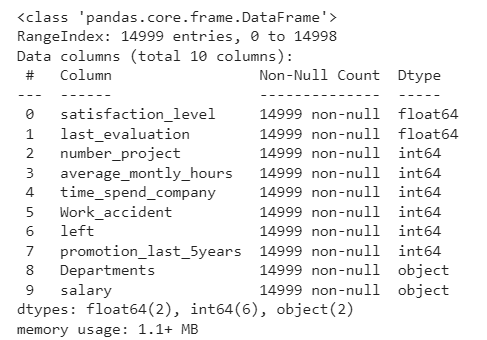
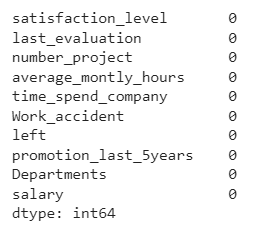
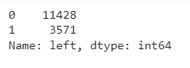
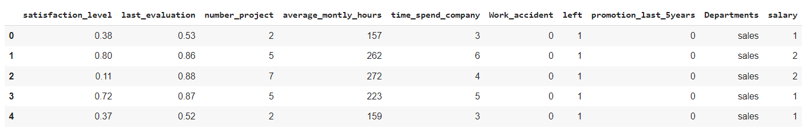
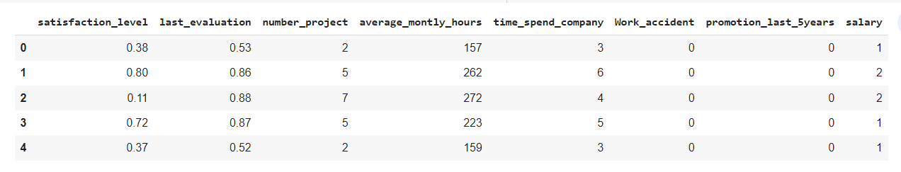
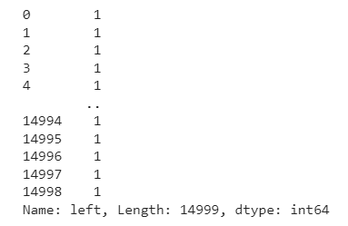
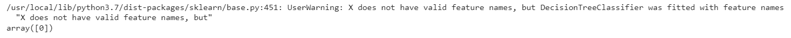

# Implementation-of-Decision-Tree-Classifier-Model-for-Predicting-Employee-Churn

## AIM:
To write a program to implement the Decision Tree Classifier Model for Predicting Employee Churn.

## Equipments Required:
1. Hardware – PCs
2. Anaconda – Python 3.7 Installation / Jupyter notebook

## Algorithm
1. Import the required libraries
2. Upload and read the dataset.
3. Gather information and presence of null in the dataset
From sklearn.tree import DecisionTreeClassifier and use criterion as entropy.
4. Find the accuracy score of the model.
5. Check the trained model.

## Program:
```
/*
Program to implement the Decision Tree Classifier Model for Predicting Employee Churn.
Developed by: Subramaniya Pillai B
RegisterNumber: 212221230109
*/
#import packages
import pandas as pd
df=pd.read_csv("Employee.csv")
df.head()
#checking the data information and null presence
df.info()
df.isnull().sum()
#checking the count of left column
df["left"].value_counts()
#encoding categorical features to numeric
from sklearn.preprocessing import LabelEncoder
le=LabelEncoder()
df["salary"]=le.fit_transform(df["salary"])
df.head()
#assigning x and y array and display them
x=df[["satisfaction_level","last_evaluation","number_project",
"average_montly_hours","time_spend_company","Work_accident",
"promotion_last_5years","salary"]]
x.head()
y=df["left"]
y
#splitting data into training and test
#implementing decision tree classifier in training model
from sklearn.model_selection import train_test_split
x_train,x_test,y_train,y_test=train_test_split(x,y,test_size=0.2,random_state=100)
from sklearn.tree import DecisionTreeClassifier
dt=DecisionTreeClassifier(criterion="entropy")
dt.fit(x_train,y_train)
y_pred=dt.predict(x_test)
#calcuating accuracy score
from sklearn import metrics
acc=metrics.accuracy_score(y_test,y_pred)
acc
#testing the model
dt.predict([[.5,.8,9,260,6,0,1,2]])
```

## Output:


















## Result:
Thus the program to implement the  Decision Tree Classifier Model for Predicting Employee Churn is written and verified using python programming.
